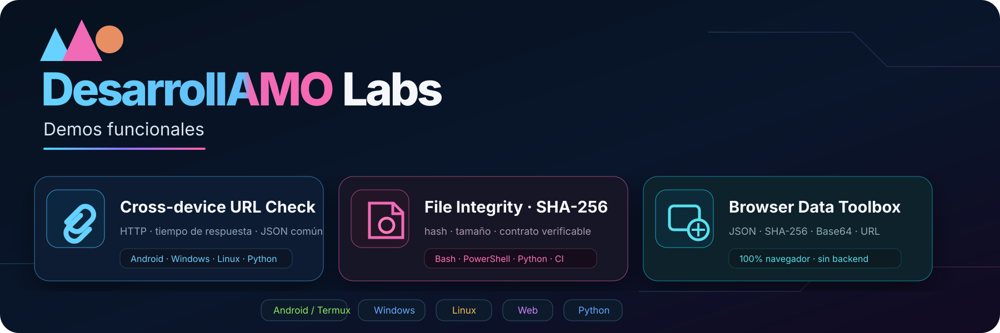
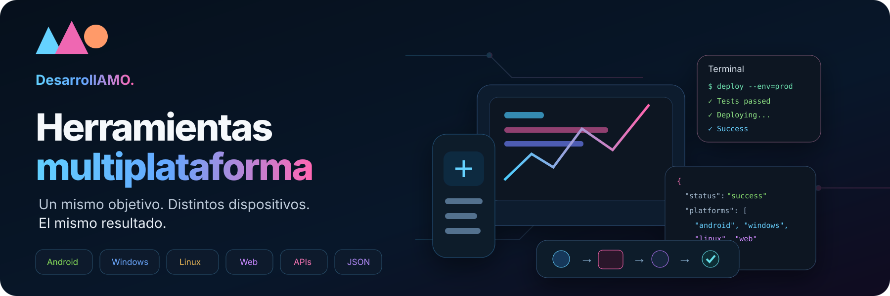

<div align="center">
  

  <br />

  **Software que se puede abrir, ejecutar, probar y mejorar.**

  [🌐 Sitio principal](https://desarrollamo.com.ar/) · [🧪 Demos funcionales](demos/) · [💻 GitHub](https://github.com/amoedo7)
</div>

---

## Tecnología útil, presentada con evidencia

DesarrollAMO convierte necesidades concretas en **sitios, aplicaciones, scripts, automatizaciones, APIs e integraciones** pensadas para funcionar en el entorno real del cliente.

No hace falta llegar con una arquitectura definida. El punto de partida puede ser mucho más simple:

> **“Tengo este problema y quiero que deje de hacerse manualmente.”**

A partir de ahí buscamos el camino técnico más directo, lo construimos, lo probamos y dejamos una entrega que se pueda usar.

### Capacidades visibles

| | Capacidad | Entregas típicas |
|---|---|---|
| 🌐 | **Web & sistemas** | landings, paneles, herramientas internas, frontends |
| 📱 | **Apps & móvil** | Android, utilidades móviles, flujos Termux |
| ⚙️ | **Automatización** | Bash, PowerShell, Python, tareas repetibles |
| 🔌 | **Integraciones** | APIs, JSON, servicios conectados, sincronización |
| 🗄️ | **Datos** | PostgreSQL, Supabase, migraciones, estructuras de datos |
| 🔎 | **Auditoría técnica** | compatibilidad, seguridad, errores y oportunidades de mejora |

---

<div align="center">
  
</div>

## Demos que podés revisar hoy

Las demos son pequeñas a propósito: cada una intenta demostrar **una capacidad concreta** con código visible, instrucciones simples y resultados verificables.

<table>
<tr>
<td width="33%" valign="top">

### 🔗 Cross-device URL Check

Comprueba una URL, mide respuesta y devuelve un contrato JSON común.

**Entornos**  
`Android/Termux` `Linux` `macOS` `Windows` `Python`

[**Ver demo →**](demos/cross-device-url-check/)

</td>
<td width="33%" valign="top">

### 🔐 File Integrity · SHA-256

Verifica hash, tamaño y nombre de archivo con implementaciones distintas y una misma salida.

**Entornos**  
`Bash` `PowerShell` `Python` `CI`

[**Ver demo →**](demos/file-integrity/)

</td>
<td width="33%" valign="top">

### 🧰 Browser Data Toolbox

Herramienta visual para JSON, SHA-256, Base64 e inspección de URLs. Todo ocurre localmente en el navegador.

**Entorno**  
`Web` `Web Crypto` `Sin backend`

[**Ver demo →**](demos/browser-data-toolbox/)

</td>
</tr>
</table>

**[Abrir el catálogo completo de DesarrollAMO Labs →](demos/)**

---

<div align="center">
  
</div>

## Un mismo objetivo, distintos dispositivos

Cuando un flujo debe convivir con equipos diferentes, intentamos conservar **el mismo contrato de datos y el mismo comportamiento observable**, aunque cambie la implementación.

```text
necesidad
   ↓
Android / Windows / Linux / Web
   ↓
implementaciones adecuadas a cada entorno
   ↓
resultado compatible y verificable
```

Eso permite integrar dispositivos sin obligar a toda una operación a migrar a una única plataforma.

### Verificación automática

El repositorio incluye GitHub Actions para validar el contrato de **File Integrity** en:

`Ubuntu` · `macOS` · `Windows`

La prueba compara el `schema`, el hash SHA-256, el tamaño y el nombre de archivo generado por implementaciones distintas.

---

## Cómo trabajamos

<table>
<tr>
<td align="center"><strong>01</strong><br/>ENTENDER<br/><sub>problema, usuario y restricciones</sub></td>
<td align="center">→</td>
<td align="center"><strong>02</strong><br/>DISEÑAR<br/><sub>el camino técnico más útil</sub></td>
<td align="center">→</td>
<td align="center"><strong>03</strong><br/>CONSTRUIR<br/><sub>primero el flujo que aporta valor</sub></td>
<td align="center">→</td>
<td align="center"><strong>04</strong><br/>PROBAR<br/><sub>comportamiento y compatibilidad</sub></td>
<td align="center">→</td>
<td align="center"><strong>05</strong><br/>ENTREGAR<br/><sub>algo que realmente se pueda usar</sub></td>
</tr>
</table>

---

## Stack que aparece en estas soluciones

`Python` · `JavaScript` · `HTML/CSS` · `Android` · `Bash` · `PowerShell` · `Linux` · `Termux` · `GitHub Actions` · `PostgreSQL` · `Supabase` · `Netlify` · `APIs` · `JSON`

## Estructura de este repositorio

```text
landings/
├── assets/github/              identidad visual del showcase
├── branding/                   piezas reutilizables de marca
├── demos/                      herramientas públicas y verificables
│   ├── cross-device-url-check/
│   ├── file-integrity/
│   └── browser-data-toolbox/
├── clientes/                   material histórico preservado
├── plantilla_base/             base web reutilizable
├── index.html                  showcase web en evolución
└── .github/workflows/          validación automática
```

---

<div align="center">

### ¿Tenés algo para resolver?

**Mostranos el problema. Construimos el camino.**

[**desarrollamo.com.ar →**](https://desarrollamo.com.ar/)

<sub>DesarrollAMO · Software · automatización · sistemas</sub>

</div>
